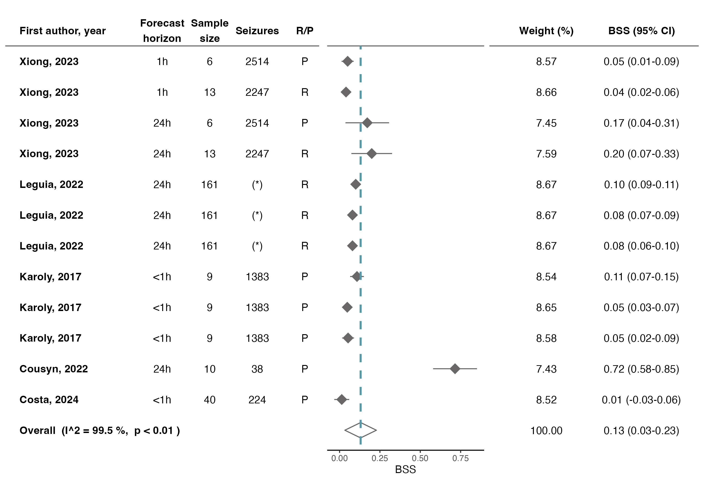

# Forest plots with ggplot2

## Why forest plots?

Forest plots provide a graphical summary of multiple individual results, allowing for quick visual assessment. They are a flexible tool in evidence synthesis, allowing for interpretation of complex data in a coherent and comprehensive manner. Uses of forest plots include:

- Comparison of results and confidence intervals, making it easier to identify consistency or variability in results
- Estimation of overall result
- Stratification by specific factors

## What are we trying to understand?

In this case, I used forest plots in the context of a meta-analysis to summarize the current performance of automated algorithms for the forecast of seizure risk. The main objectives were to answer the following questions:

**Q1:** What is the benchmark performance of automated algorithms for forecast of seizure risk?  
**Q2:** Which data are the most valuable biomarkers for seizures?  
**Q3:** Which algorithm design factors provide more informative forecasts?

## Exploring data

As a newcomer to R, I started on a post by [Katherine Hoffman](https://www.khstats.com/blog/forest-plots/), which used 𝑚𝑒𝑡𝑎𝑓𝑜𝑟, 𝑔𝑔𝑝𝑙𝑜𝑡2, and 𝑝𝑎𝑡𝑐ℎ𝑤𝑜𝑟𝑘. But, I was finding it challenging to customize the visualization (namely, when it came to **subgroup analysis** and adding **algorithm characteristics** to it).

So I adapted the original code to, without the need to modify the original data (spreadsheet), do the following:

- Perform subgroup analysis by providing only the name of the column that sets the subgroup strategy
- Expand visualization with algorithm characteristics (forecast horizon, sample size, number of seizures, and train/test approach)
- Customize colors and symbols

Given the probabilistic nature of the forecast of seizure risk _(cite paper here)_, I decided to include a probabilistic metric of performance - **Brier Skill Score (BSS)**, which is heavily inspired by the task of weather forecast. Nevertheless, since deterministic metrics still remain the most commonly reported measures of performance for such tasks, I also decided to include **Area Under the ROC Curve (AUC)**.

#### Q1. Performance benchmark

The estimates of AUC and BSS set the overall performance of state-of-the-art algorithms to 0.71 (CI 0.68-0.75) and 0.13 (CI 0.03-0.23), respectively. The image bellow shows the forest plot for BSS.

These results indicate a reasonable deterministic performance while leaving room for improvement (AUC over 0.90 are generally assumed to be good). The BSS, on the other hand, shows only marginal improvements (> 0) over a reference forecast (e.g. random guessing), indicating a large window of opportunity for improvement.

It is relevant to highlight, however, that I^2 is very large, indicating substantial variability in the results of the studies within this subgroup (which cannot be attributed to chance alone). This means that the overall estimate should be interpreted with caution, since the results may not be generalizable across different algorithm characteristics (e.g. forecast horizons or input data).

#### Q2. Seizure biomarkers

Subgroup analysis comes in handy to compare different algorithm characteristics, such as the type of data used. The image below shows the forest plot for AUC, stratified by type of input data.

This stratified version of the forest plot shows us how the algorithms performed according to the type of input data. We may feel inclined to believe that heart rate (HR) data is the most informative for the forecast of seizure risk, since is the subgroup with the highest AUC performance (0.79, CI 0.71-0.88). However, a single study (even with 15 subjects) is probably not representative of reality.

For example, using seizure times in combination with other types of input, which has a subtotal estimate of 0.70 (CI 0.67-073), may be a more robust estimate while still achieving a reasonable performance (especially given the large decrease in heterogeneity!).

#### Q3. Algorithm design

Finally, the same strategy can be used to answer questions regarding algorithm design. Let's take forecast horizon as an example.

Algorithms that forecast seizure risk for the next 1 hour are surprisingly homogeneous, which suggests that we have a good estimate on performance. Given that an AUC of 0.73 (CI 0.70-0.76) is a reasonable performance, we may interpret these results as a good indication that using a forecast horizon of 1 hour will also achieve reasonable performances and should be further explored.

Of course, when deciding on algorithm design characteristics (such as the horizon of a forecast) other factors **must** be taken into consideration, namely the preferences of future users! For this it may be useful to meet potential users or resort to literature surveys.
